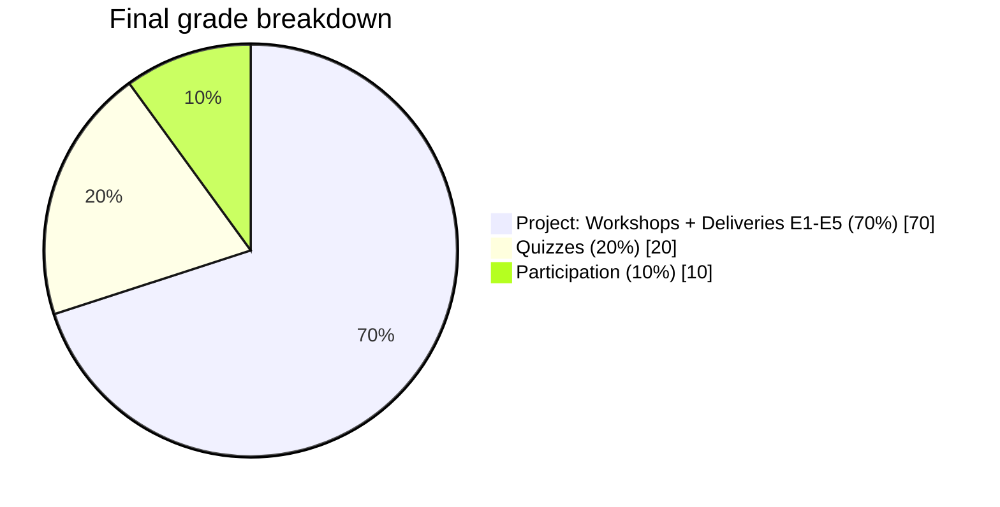
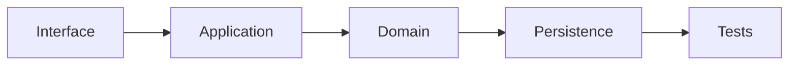
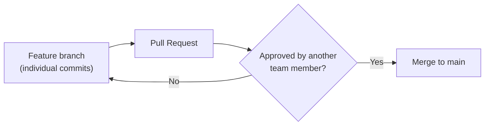
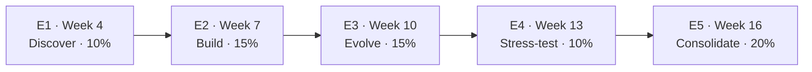
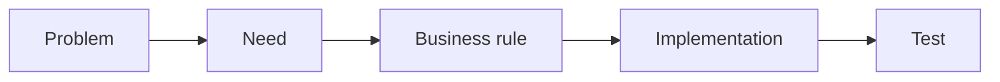
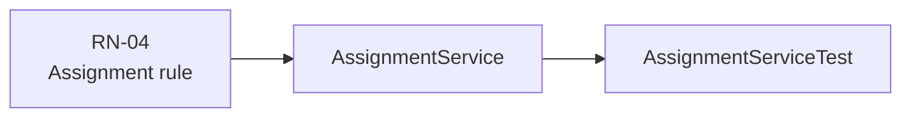
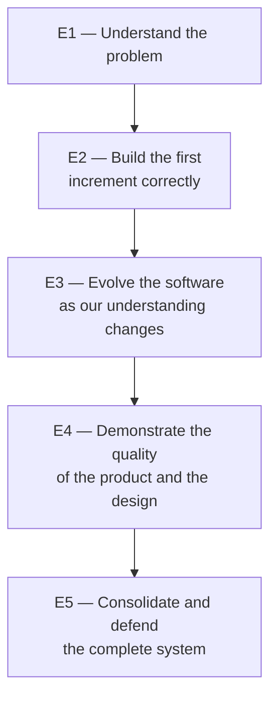

# Course Project — Software Engineering I

**Universidad Nacional de Colombia — Bogotá Campus**
**Facultad de Ingeniería · Departamento de Sistemas e Industrial**
**Course:** Software Engineering I (2016701) · 2026-II
**Instructor:** Alejandro Pulido Cruz

---

## 1. Nature of the Project

The project accounts for **70 % of the final grade** and runs throughout the entire semester. Its purpose is to integrate, in a hands-on way, the main topics covered in Software Engineering I:

- Requirements engineering.
- Software design fundamentals.
- Software architecture.
- Incremental construction.
- Testing and software quality.
- Software evolution.

> **Reconciliation note with the syllabus.** The 70 % consolidates, into a single five-delivery structure (E1–E5), what the weekly syllabus schedule splits into two separate grading categories: *Workshops/labs* and the two *Project Deliveries*. Using the general syllabus's weights (Workshops 25 % + Delivery 1 20 % + Delivery 2 25 % = 70 %; Quizzes 20 % + Participation 10 % = the remaining 30 %), the numbers reconcile exactly. The eight in-class Workshops on the weekly schedule (case-study analysis, requirements, UML, Git, data-access layer, business logic, testing) are no longer graded as a separate category — they become the formative activities that feed into deliveries E1–E5. Outstanding item: the Group 1 and Group 2 syllabi carry different assessment weights (15/35/20/30, with no participation line) that do not yet match this 70/20/10 split and still need to be updated so all three documents agree.

### 1.1 A Product, Not a Contract Project

This is not a contract project — it is a product. No one will tell you exactly what to build. Each team must identify a problem, decide what product to develop, and demonstrate that the product solves a real problem for someone who is under no obligation to use it.

This requires discovering needs, validating assumptions, making product decisions, and adjusting scope as the team learns.

### 1.2 Delivery Mode

The product will be developed as a **service**. The application runs on the provider's side and requires no installation on the user's machine.

---

## 2. Central Principle of the Project

Every project must clearly answer the following question:

> **What does your software decide that a human would otherwise have to decide by hand today?**

If the answer is "nothing," the proposal will be rejected. Saving, listing, editing, and deleting records does not, by itself, constitute business logic — those operations represent data storage and management.

The project must contain real business rules, for example:

- Assignment.
- Prioritization.
- Calculations.
- Cross-field validations.
- Constraints.
- State transitions.
- Classification.
- Selection among alternatives.
- Policy enforcement.
- Conflict detection.

During deliveries and defenses, the team must be able to identify where these decisions live inside the software.

---

## 3. Development Process

The project will follow an **iterative and incremental** approach. Each delivery represents a functional increment of the product, which means:

> Each increment must contain working software, not documents describing software that will work in the future.

A waterfall implementation disguised as iterations is not accepted. For example, it is **not valid** to organize the semester like this:

- Delivery 2: data model.
- Delivery 3: backend.
- Delivery 4: interface.
- Delivery 5: integration.

Each increment must implement at least one functional **vertical slice** that crosses the necessary parts of the system. The functionality can be small, but it must work end to end.

---

## 4. Mandatory Development Practices

### 4.1 Git Repository

The team must use a Git repository from day one. The repository must preserve a real history of the development process. Each member must make their own commits under their own identity — a single person committing on behalf of the whole team is not accepted.

### 4.2 Peer Review

Every change that reaches the main branch must go through a Pull Request (PR). Every Pull Request must be approved by at least one other team member. Direct commits to the main branch are not allowed.

### 4.3 Unit Tests

Business logic must be covered by unit tests. Tests for business rules must:

- Run without starting the application.
- Run without a server.
- Run without a database.
- Be deterministic.
- Cover relevant domain cases.

A **minimum coverage of 80 %** is required over the classes that implement business logic. Coverage is a necessary but not sufficient condition — test quality will also be evaluated, including normal cases, edge cases, invalid conditions, expected errors, domain invariants, and relevant rule combinations. High coverage does not compensate for tests that fail to actually exercise the business rules.

### 4.4 Verifiable README

The repository must contain a `README.md` that allows someone outside the team, **without the team's help**, to:

1. Clone the repository.
2. Identify what the product does.
3. Run the application.
4. Run the tests.

---

## 5. Technology Stack

The technology stack is a **free choice** for each team — the course does not mandate a language, framework, or view technology. Pick something your team can commit to and defend for the whole semester.

Whatever stack is chosen, the project must still satisfy every other requirement in this document. In particular:

- **Architecture:** Monolithic. A single repository, a single deployable artifact, a single running process. No microservices, no distributed architecture.
- **Interface:** Server-rendered or otherwise integrated into the same deployable artifact — a separate SPA-style frontend consuming a REST API as an internal boundary is not allowed (see Section 9 for the one exception: a single external API, behind a purpose-built adapter).
- **Database:** Embedded / file-based, so the application starts with a single command and no separate database server needs to be installed or configured (Sections 6 and 7).
- **Build & run:** A documented, single-command way to build, run, and test the project, with the build tool's wrapper committed to the repository if the chosen ecosystem has one (e.g. `./mvnw`, `./gradlew`, a dependency lockfile, etc.).

Document the chosen stack and the reasoning behind it in the architecture document starting at E2 (Section 21).

---

## 6. Reproducible Execution

The application must be startable with a single documented command. It must not be necessary to install additional servers, manually configure environment variables, pre-create databases, run manual scripts, or perform external configuration before starting. Environment reproducibility is part of the evaluation.

---

## 7. Database

The application will use an embedded relational database. The schema must be versioned within the repository. The project must include enough seed data to exercise realistic domain scenarios — a demo with three records can hide important bugs.

The data used during demos must make it possible to observe different states, different rule combinations, normal cases, edge cases, and relevant conflicts or constraints.

---

## 8. Isolated Business Logic

Business rules must be separated from infrastructure details. It must be possible to test them without starting the application, without starting a server, without connecting to a database, and without calling external services.

This is a verifiable, gradable criterion. During a defense, a student may be asked to identify a business rule, show where it is implemented, and explain how it is tested in isolation.

---

## 9. External APIs

At most **one** external API is allowed, and it must simultaneously satisfy:

1. It cannot be the core of the product.
2. The product must remain useful if the API is unavailable.
3. It must sit behind a purpose-built adapter.
4. A fake implementation must exist for testing.
5. Its use must be justified in writing.

---

## 10. Choosing the Problem

The problem must be realistic, sufficiently scoped for a semester, accessible to the team, verifiable with users, and rich enough in business logic. The team must have access to at least one real potential user.

Possible contexts include: students, professors, student groups, university units, neighborhood businesses, organizations, communities, clubs, sports groups, or associations that a team member belongs to.

Original takes on products that already exist are allowed, provided the scope is appropriate and there is enough business logic.

---

## 11. Topics Not Allowed

Not accepted:

- Video games.
- Topics already approved for another team.
- Projects built on top of an existing repository.
- Projects derived directly from tutorials.
- Projects from previous semesters.

Topics will be assigned on a first-approved basis.

---

## 12. Teams

Each team will be made up of **five members**. Team composition is fixed at Delivery 1 and cannot change during the semester, except when a team member formally withdraws from the course — in that case, the team must report the situation in writing so the expected project scope can be adjusted.

---

## 13. Deliveries

The project will have five deliveries.

| Delivery | Week | Purpose | Weight |
|---|---|---|---|
| E1 | 4 | Product proposal and requirements | 10 % |
| E2 | 7 | Increment 1 | 15 % |
| E3 | 10 | Increment 2 | 15 % |
| E4 | 13 | Increment 3 | 10 % |
| E5 | 16 | Final increment and closing | 20 % |
| | | **Project total** | **70 %** |

Percentages correspond to the total course grade.

---

## 14. E1 — Discover: Product Proposal and Requirements

The first delivery aims to demonstrate that there is a problem interesting enough to justify developing the product. The document must, at minimum, answer:

**Problem**
- Who has the problem?
- What is the problem?
- How is it solved today?
- Why is it worth solving?

**User**
Evidence must be presented of at least one interview with a real potential user, stating who they talked to, when, what they learned, which assumptions were confirmed or rejected, and what changed in the idea after the conversation.

**Software decisions**
The team must explicitly answer what their software decides that a human would otherwise have to decide by hand, and identify the main candidate business rules.

**Scope**
Must specify what is intended to be built, what is explicitly out of scope, and what the main expected capabilities are.

**Viability as a product**
The team must briefly answer who would be willing to use or pay for this product, and why. No financial model is required.

**Architecture**
Architecture is not requested at this delivery. The problem must be understood before the solution is designed.

---

## 15. E2 — Build: First Increment

The second delivery must contain the first functional increment of the product, solving at least one business rule end to end, even if it is the simplest one. It must include:

- Working software.
- First vertical slice.
- Business-logic tests.
- Verifiable README.
- Initial architecture document.
- Domain model.
- Component structure.
- Main dependencies.

---

## 16. E3 — Evolve: Second Increment

The second increment must incorporate new requirements and demonstrate the team's ability to evolve existing software. This is not evaluated merely as adding features — the team must show how new learning or requirements affect the domain model, existing rules, the design, the tests, and the implementation. Refactoring is expected where necessary.

---

## 17. E4 — Stress-Test: Third Increment

The third increment goes deeper into product quality. The team must work on edge cases, error scenarios, complex rule combinations, test quality, design quality, maintainability, and architectural decisions. The goal is to demonstrate that the product works beyond the happy path.

---

## 18. E5 — Consolidate: Final Increment and Closing

The final delivery must present the integrated product. The team must demonstrate the product working, compliance with the agreed scope, business rules, test quality, resulting architecture, requirements evolution, main design decisions, and the ability to modify and maintain the software. All team members take part in the final defense.

---

## 19. Requirements Evolution

Requirements are not considered frozen after E1. Starting at E2, each delivery must briefly record what the team learned during the iteration:

| Learning | Change made | Evidence |
|---|---|---|
| What did we learn? | What changed in the product? | How do we know? |

Extensive documentation is not expected. The goal is to show that the team can adapt the product as its understanding of the problem grows.

---

## 20. Minimum Traceability

The team must be able to establish a relationship between problem, need, business rule, implementation, and test. An extensive traceability matrix is not required; however, during a delivery or defense it must be possible to pick a rule and walk through its implementation.

**Example:**

The traceability must correspond to the real software.

---

## 21. Architecture Document

Starting at E2, the project must maintain an architecture document showing, at minimum: layer organization, domain model, main components, responsibilities, dependencies between components, and relevant architectural decisions.

The documented architecture must correspond to what is actually implemented. During a defense, a component may be selected from the diagram and the student may be asked to locate it in the repository, explain its responsibility, identify its dependencies, and justify why it lives there.

A diagram that does not represent the code is not valid architecture documentation.

---

## 22. Individual Defenses

All deliveries include a defense. In E1–E4, team members will be randomly selected to answer individually about the work presented — a student may be questioned about code written by another team member. In E5, all team members are evaluated.

The individual defense grade modulates the team's grade for the delivery. Therefore:

> It is the team's collective responsibility to ensure that every member understands the product.

During a defense, a student may be asked to, among other things: explain a business rule, locate its implementation, explain a design decision, identify a dependency, explain a test, predict what happens in a given scenario, identify which test would fail after a change, make a small modification to the software, or explain code written by another team member.

---

## 23. Use of AI Assistants

The use of AI assistants is allowed. The team must include a short section in `README.md` stating which tools were used, in which parts of the project, and for what purpose. There is no penalty for using AI tools.

However:

> The team may use AI to produce software, but it cannot delegate understanding of the software.

All code, tests, documents, or decisions submitted by the team must be explainable and defensible by its members. Individual defenses are the main verification mechanism for this.

---

## 24. Minimum Documentation

The project must maintain only the documentation necessary to understand, run, and evolve the product.

**`README.md`** must include: what the product is, what problem it solves, how to run the application, how to run the tests, and the AI-use disclosure.

**Architecture document** must include: layers, domain model, components, responsibilities, dependencies, and main architectural decisions.

Documentation must evolve together with the software.

---

## 25. Deployment

Deploying the application is optional. If a team chooses to do so, it must use free services or available academic/free credits — students should not spend their own money to deploy the project. No evaluation criterion depends on having a working public deployment.

---

## 26. Ownership of the Work

The product developed belongs to its authors. The course and the University make no claim to ownership of the software built by students as part of the project.

---

## 27. Philosophy of the Project

The goal of the project is not to build the application with the largest number of features, nor to use as many technologies as possible. The goal is to learn how to turn a real problem into software that can evolve in a disciplined way.

By the end of the project, every team member must be able to walk through and explain the relationship between **Problem → Requirements → Design → Code → Tests**. That walkthrough is one of the main pieces of evidence of learning in Software Engineering I.
